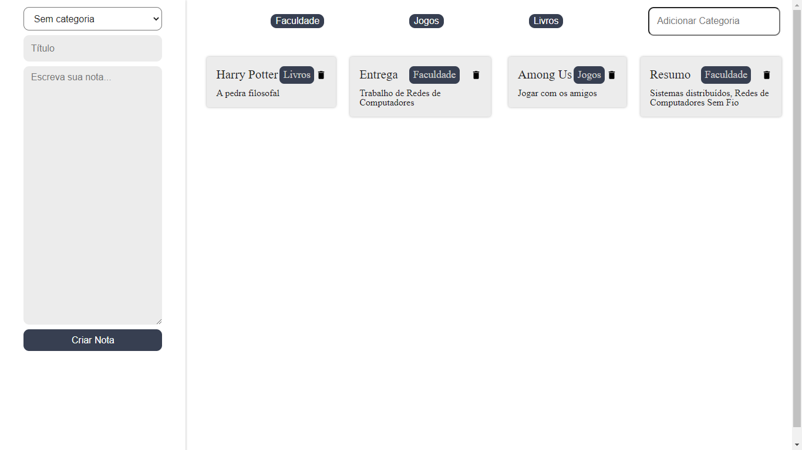

# App de anotações

## Projeto feito para acompanhar as aulas do curso de React da Alura
___
## O que aprendi/pratiquei:
* Componente ```Fragment```
* Componentes _stateless_ e _statefull_
* Padrão de projeto Observable
* Ciclo de vida dos componentes

## Preview
